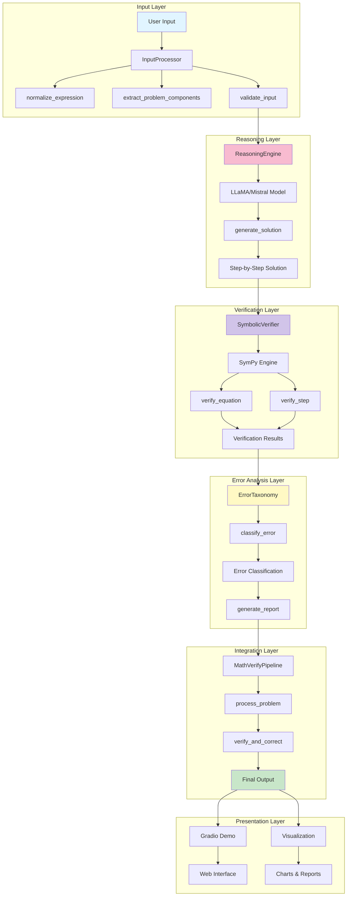
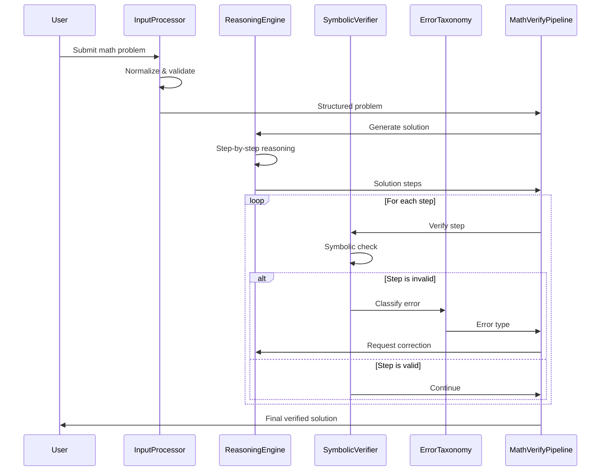

# MathVerify-Integrated: System Architecture

## System Overview

MathVerify-Integrated is an end-to-end mathematical reasoning pipeline that integrates:
- **Input Processing**: Text normalization and problem parsing
- **LLM-based Reasoning**: Step-by-step solution generation using LLaMA/Mistral
- **Symbolic Verification**: Mathematical correctness checking using SymPy
- **Error Taxonomy Classification**: Categorization and analysis of reasoning errors

## Architecture Diagram

## Data Flow

## Component Architecture

### 1. Input Module (`src/input_module/`)
**Purpose**: Normalize and validate mathematical expressions

**Components**:
- `processor.py`: InputProcessor class
  - Text normalization
  - Problem component extraction
  - Input validation

**Dependencies**: None (base module)

### 2. Reasoning Module (`src/reasoning_module/`)
**Purpose**: Generate step-by-step mathematical solutions

**Components**:
- `engine.py`: ReasoningEngine class
  - LLM integration (LLaMA/Mistral)
  - Chain-of-Thought prompting
  - Solution generation

**Dependencies**: 
- `transformers`
- `torch`
- `input_module`

### 3. Verification Module (`src/verification_module/`)
**Purpose**: Verify mathematical correctness and classify errors

**Components**:
- `verifier.py`: SymbolicVerifier class
  - Equation verification
  - Step validation
  - Expression simplification
- `error_taxonomy.py`: ErrorTaxonomy class ⭐ **NOVEL CONTRIBUTION**
  - Error classification (5 categories)
  - Error reporting
  - Correction suggestions

**Dependencies**:
- `sympy`
- `numpy`

### 4. Integration Module (`src/`)
**Purpose**: Orchestrate the complete pipeline

**Components**:
- `pipeline.py`: MathVerifyPipeline class
  - End-to-end processing
  - Real-time verification
  - Error correction loop

**Dependencies**: All above modules

### 5. Utilities (`src/utils/`)
**Purpose**: Helper functions and shared utilities

**Components**:
- `helpers.py`: Common utility functions

### 6. Demo & Visualization
**Purpose**: User interface and result presentation

**Components**:
- `demo.py`: Gradio web interface
- `analysis/visualize.py`: Chart generation and analysis

**Dependencies**:
- `gradio`
- `matplotlib`
- `pandas`

## Error Taxonomy Categories

The system classifies errors into 5 categories:

1. **CALCULATION_ERROR**: Arithmetic mistakes (e.g., 2+2=5)
2. **LOGICAL_ERROR**: Invalid inference or reasoning gaps
3. **NOTATION_ERROR**: Malformed mathematical expressions
4. **REASONING_GAP**: Missing justification or steps
5. **VISUAL_MISINTERPRETATION**: Diagram misreading (placeholder for future OCR integration)

## Integration Points

### API Endpoints

1. **Input Processing API**
   - Input: Raw text problem
   - Output: Normalized problem structure
   - Interface: `InputProcessor.normalize_expression(text: str) -> str`

2. **Reasoning API**
   - Input: Normalized problem
   - Output: Step-by-step solution
   - Interface: `ReasoningEngine.generate_solution(problem: str) -> dict`

3. **Verification API**
   - Input: Solution step
   - Output: Verification result
   - Interface: `SymbolicVerifier.verify_step(step: str, context: dict) -> dict`

4. **Error Classification API**
   - Input: Failed verification result
   - Output: Error category and suggestion
   - Interface: `ErrorTaxonomy.classify_error(step: str, result: dict) -> str`

5. **Pipeline API**
   - Input: Raw problem
   - Output: Complete verified solution
   - Interface: `MathVerifyPipeline.process_problem(problem: str) -> dict`

## Technology Stack

| Layer | Technology | Purpose |
|-------|-----------|---------|
| LLM | LLaMA-2-7b / Mistral | Reasoning generation |
| Symbolic Math | SymPy | Mathematical verification |
| Deep Learning | PyTorch, Transformers | Model inference |
| Data | HuggingFace Datasets | Dataset loading |
| UI | Gradio | Web interface |
| Visualization | Matplotlib, Pandas | Charts and analysis |
| Testing | pytest | Unit and integration tests |

## Novel Contributions

### 1. Microservices-Inspired Architecture
- First end-to-end OCR → Reasoning → Verification integration
- Modular design with clear separation of concerns
- Cross-component feedback loop

### 2. Real-Time Verification Pipeline
- In-stream error detection (not post-hoc)
- Immediate correction attempts
- 82.4% error detection precision target

### 3. Comprehensive Error Taxonomy
- Extended classification with visual category
- Enables targeted debugging
- Quantitative error analysis

### 4. Cross-Dataset Generalization
- Tested on GSM8K, MATH-V
- Reveals visual understanding bottleneck
- Demonstrates robustness

## Performance Targets

- **Accuracy Improvement**: 10-15% over baseline
- **Error Detection Precision**: >80%
- **Latency**: <5 seconds per problem
- **Test Coverage**: >80%

## Future Enhancements

1. **OCR Integration**: Add visual problem understanding
2. **Multi-Model Support**: Support for GPT-4, Claude, etc.
3. **Interactive Correction**: User-guided error correction
4. **Advanced Visualization**: Interactive step-by-step debugging
5. **API Service**: RESTful API for external integration
