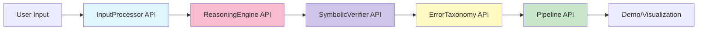
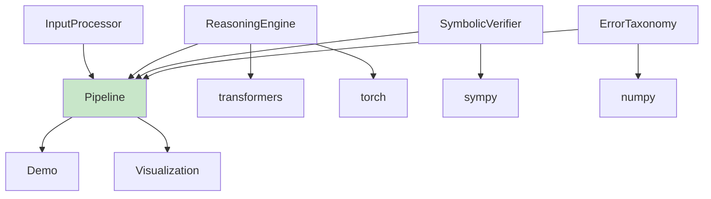

# MathVerify-Integrated: Integration Points

## Overview
This document defines all integration points, APIs, and interfaces between components in the MathVerify-Integrated system.

## Component Integration Map



## API Specifications

### 1. InputProcessor API

**Module**: `src.input_module.processor`

#### 1.1 normalize_expression()
```python
def normalize_expression(text: str) -> str:
    """
    Converts mathematical notation to canonical form.
    
    Args:
        text (str): Raw mathematical expression
        
    Returns:
        str: Normalized expression
        
    Examples:
        >>> processor.normalize_expression("2x + 3")
        "2*x + 3"
        >>> processor.normalize_expression("x^2")
        "x**2"
    """
```

**Input Format**:
- Raw text string with mathematical notation
- Supports: fractions (1/2), exponents (x^2), implicit multiplication (2x)

**Output Format**:
- Standardized string with explicit operators
- Python-compatible syntax

**Error Handling**:
- Returns original text if normalization fails
- Logs warnings for unrecognized patterns

#### 1.2 extract_problem_components()
```python
def extract_problem_components(text: str) -> dict:
    """
    Extracts structured components from problem text.
    
    Args:
        text (str): Problem description
        
    Returns:
        dict: {
            "question": str,
            "constraints": list[str],
            "unknowns": list[str]
        }
    """
```

**Input Format**:
- Natural language problem description

**Output Format**:
```json
{
  "question": "What is the value of x?",
  "constraints": ["x > 0", "x is an integer"],
  "unknowns": ["x"]
}
```

#### 1.3 validate_input()
```python
def validate_input(text: str) -> bool:
    """
    Checks if input is valid mathematical text.
    
    Args:
        text (str): Input to validate
        
    Returns:
        bool: True if valid, False otherwise
    """
```

---

### 2. ReasoningEngine API

**Module**: `src.reasoning_module.engine`

#### 2.1 generate_solution()
```python
def generate_solution(problem: str) -> dict:
    """
    Generates complete step-by-step solution.
    
    Args:
        problem (str): Normalized problem text
        
    Returns:
        dict: {
            "steps": [
                {
                    "number": int,
                    "content": str,
                    "rationale": str
                }
            ],
            "final_answer": str,
            "confidence": float  # 0.0-1.0
        }
    """
```

**Input Format**:
- Normalized problem text from InputProcessor

**Output Format**:
```json
{
  "steps": [
    {
      "number": 1,
      "content": "Let x = 5",
      "rationale": "Given in problem statement"
    },
    {
      "number": 2,
      "content": "2*x + 3 = 2*5 + 3 = 13",
      "rationale": "Substitute x=5 and calculate"
    }
  ],
  "final_answer": "13",
  "confidence": 0.95
}
```

**Error Handling**:
- Returns empty steps list if model fails
- Sets confidence to 0.0 on error
- Logs model errors

#### 2.2 generate_single_step()
```python
def generate_single_step(problem: str, previous_steps: list) -> dict:
    """
    Generates next reasoning step.
    
    Args:
        problem (str): Original problem
        previous_steps (list): List of previous step dicts
        
    Returns:
        dict: {
            "content": str,
            "rationale": str
        }
    """
```

---

### 3. SymbolicVerifier API

**Module**: `src.verification_module.verifier`

#### 3.1 verify_equation()
```python
def verify_equation(equation: str) -> dict:
    """
    Verifies mathematical equation correctness.
    
    Args:
        equation (str): Equation to verify (e.g., "2 + 2 = 4")
        
    Returns:
        dict: {
            "valid": bool,
            "error": str or None,
            "details": {
                "left_side": str,
                "right_side": str,
                "difference": float
            }
        }
    """
```

**Input Format**:
- String equation with "=" operator
- Examples: "2 + 2 = 4", "x + 5 = 10", "sqrt(16) = 4"

**Output Format**:
```json
{
  "valid": true,
  "error": null,
  "details": {
    "left_side": "4",
    "right_side": "4",
    "difference": 0.0
  }
}
```

**Error Cases**:
```json
{
  "valid": false,
  "error": "Left side (5) does not equal right side (4)",
  "details": {
    "left_side": "5",
    "right_side": "4",
    "difference": 1.0
  }
}
```

#### 3.2 verify_step()
```python
def verify_step(step: str, context: dict) -> dict:
    """
    Verifies single reasoning step.
    
    Args:
        step (str): Step content
        context (dict): Previous steps and problem info
        
    Returns:
        dict: {
            "valid": bool,
            "error": str or None,
            "confidence": float
        }
    """
```

**Context Format**:
```json
{
  "problem": "original problem text",
  "previous_steps": [
    {"number": 1, "content": "...", "verified": true}
  ],
  "variables": {"x": 5, "y": 10}
}
```

#### 3.3 extract_expressions()
```python
def extract_expressions(text: str) -> list:
    """
    Finds all mathematical expressions in text.
    
    Args:
        text (str): Text to search
        
    Returns:
        list[str]: List of expressions
    """
```

#### 3.4 symbolic_simplify()
```python
def symbolic_simplify(expr: str) -> str:
    """
    Simplifies expression using SymPy.
    
    Args:
        expr (str): Expression to simplify
        
    Returns:
        str: Simplified form
    """
```

---

### 4. ErrorTaxonomy API

**Module**: `src.verification_module.error_taxonomy`

#### 4.1 classify_error()
```python
def classify_error(step: str, verification_result: dict) -> str:
    """
    Classifies error type from failed verification.
    
    Args:
        step (str): Failed step content
        verification_result (dict): Result from verifier
        
    Returns:
        str: Error category (one of 5 types)
    """
```

**Error Categories**:
1. `CALCULATION_ERROR`: Arithmetic mistakes
2. `LOGICAL_ERROR`: Invalid inference
3. `NOTATION_ERROR`: Malformed expressions
4. `REASONING_GAP`: Missing justification
5. `VISUAL_MISINTERPRETATION`: Diagram misreading

**Output**: Single string from above categories

#### 4.2 get_error_description()
```python
def get_error_description(error_type: str) -> str:
    """
    Returns human-readable error description.
    
    Args:
        error_type (str): Error category
        
    Returns:
        str: Description
    """
```

**Example Output**:
```
"CALCULATION_ERROR: An arithmetic mistake was made in computing the numerical result."
```

#### 4.3 suggest_correction()
```python
def suggest_correction(error_type: str, step: str) -> str:
    """
    Suggests how to fix the error.
    
    Args:
        error_type (str): Error category
        step (str): Failed step
        
    Returns:
        str: Correction suggestion
    """
```

#### 4.4 generate_report()
```python
def generate_report(errors: list) -> dict:
    """
    Generates error analysis report.
    
    Args:
        errors (list): List of error dicts
        
    Returns:
        dict: {
            "total_errors": int,
            "by_type": {"CALCULATION_ERROR": count, ...},
            "percentage": {"CALCULATION_ERROR": pct, ...}
        }
    """
```

**Output Format**:
```json
{
  "total_errors": 10,
  "by_type": {
    "CALCULATION_ERROR": 5,
    "LOGICAL_ERROR": 3,
    "NOTATION_ERROR": 1,
    "REASONING_GAP": 1,
    "VISUAL_MISINTERPRETATION": 0
  },
  "percentage": {
    "CALCULATION_ERROR": 50.0,
    "LOGICAL_ERROR": 30.0,
    "NOTATION_ERROR": 10.0,
    "REASONING_GAP": 10.0,
    "VISUAL_MISINTERPRETATION": 0.0
  }
}
```

---

### 5. MathVerifyPipeline API

**Module**: `src.pipeline`

#### 5.1 process_problem()
```python
def process_problem(problem: str) -> dict:
    """
    Executes complete pipeline on a problem.
    
    Args:
        problem (str): Raw problem text
        
    Returns:
        dict: {
            "problem": str,
            "solution": dict,
            "verification": list,
            "errors": dict,
            "final_answer": str,
            "confidence": float
        }
    """
```

**Complete Output Format**:
```json
{
  "problem": "What is 2x + 3 when x = 5?",
  "solution": {
    "steps": [
      {
        "number": 1,
        "content": "Let x = 5",
        "rationale": "Given",
        "verified": true,
        "verification_result": {"valid": true}
      },
      {
        "number": 2,
        "content": "2*5 + 3 = 13",
        "rationale": "Substitute and calculate",
        "verified": true,
        "verification_result": {"valid": true}
      }
    ],
    "final_answer": "13",
    "confidence": 0.95
  },
  "verification": [
    {"step": 1, "valid": true},
    {"step": 2, "valid": true}
  ],
  "errors": {
    "total_errors": 0,
    "by_type": {},
    "corrections_attempted": 0,
    "corrections_successful": 0
  },
  "final_answer": "13",
  "confidence": 0.95
}
```

#### 5.2 verify_and_correct()
```python
def verify_and_correct(steps: list) -> list:
    """
    Verifies steps and attempts corrections.
    
    Args:
        steps (list): List of solution steps
        
    Returns:
        list: Verified steps with corrections
    """
```

**Input Format**:
```json
[
  {"number": 1, "content": "...", "rationale": "..."},
  {"number": 2, "content": "...", "rationale": "..."}
]
```

**Output Format**:
```json
[
  {
    "number": 1,
    "content": "...",
    "rationale": "...",
    "verified": true,
    "verification_result": {"valid": true},
    "error_type": null,
    "correction": null
  },
  {
    "number": 2,
    "content": "...",
    "rationale": "...",
    "verified": false,
    "verification_result": {"valid": false, "error": "..."},
    "error_type": "CALCULATION_ERROR",
    "correction": "Suggested correction..."
  }
]
```

---

## Data Flow Contracts

### Contract 1: Input → Reasoning
- **Input**: Normalized problem text (string)
- **Output**: Solution with steps (dict)
- **Guarantee**: All steps have number, content, rationale

### Contract 2: Reasoning → Verification
- **Input**: Solution steps (list of dicts)
- **Output**: Verification results (list of dicts)
- **Guarantee**: One verification result per step

### Contract 3: Verification → Error Taxonomy
- **Input**: Failed verification result (dict)
- **Output**: Error category (string)
- **Guarantee**: Category is one of 5 defined types

### Contract 4: Pipeline → Demo
- **Input**: Raw problem (string)
- **Output**: Complete result (dict)
- **Guarantee**: Contains problem, solution, verification, errors, final_answer

---

## Error Handling Strategy

### 1. Input Module
- **Invalid input**: Return original text with warning
- **Parsing failure**: Log error, return empty dict

### 2. Reasoning Module
- **Model failure**: Return empty steps, confidence=0.0
- **Timeout**: Return partial solution with warning

### 3. Verification Module
- **Invalid expression**: Mark as NOTATION_ERROR
- **SymPy error**: Log error, mark step as unverified

### 4. Error Taxonomy
- **Unknown error**: Classify as LOGICAL_ERROR
- **Missing data**: Return generic description

### 5. Pipeline
- **Component failure**: Continue with warnings
- **Critical failure**: Return error dict with details

---

## Testing Integration Points

### Unit Test Requirements
Each API must have:
1. **Happy path test**: Valid input → expected output
2. **Error path test**: Invalid input → graceful handling
3. **Edge case test**: Boundary conditions
4. **Integration test**: Component interaction

### Integration Test Scenarios
1. **End-to-end**: Raw problem → final verified solution
2. **Error correction**: Failed step → correction → re-verification
3. **Multi-step**: Complex problem with 5+ steps
4. **Error classification**: Intentional errors → correct categories

---

## Performance Contracts

| Component | Max Latency | Memory Limit |
|-----------|------------|--------------|
| InputProcessor | 100ms | 10MB |
| ReasoningEngine | 3s | 2GB |
| SymbolicVerifier | 500ms | 50MB |
| ErrorTaxonomy | 50ms | 10MB |
| Pipeline (total) | 5s | 2.5GB |

---

## Versioning & Compatibility

### API Version: 1.0.0

**Breaking Changes Policy**:
- Major version bump for interface changes
- Minor version for new features
- Patch version for bug fixes

**Backward Compatibility**:
- All APIs support dict output (JSON-serializable)
- Optional parameters have defaults
- Deprecated features logged with warnings

---

## External Integration Points

### 1. Gradio Demo
**Interface**: `MathVerifyPipeline.process_problem()`
**Data Format**: JSON
**Communication**: Direct Python function call

### 2. Visualization
**Interface**: `ErrorTaxonomy.generate_report()`
**Data Format**: Dict with error statistics
**Communication**: Direct Python function call

### 3. Future: REST API
**Planned Interface**: HTTP POST `/api/v1/solve`
**Data Format**: JSON request/response
**Authentication**: API key (future)

---

## Dependencies Graph



**Dependency Levels**:
1. **Level 0** (No dependencies): InputProcessor
2. **Level 1** (External only): ReasoningEngine, SymbolicVerifier, ErrorTaxonomy
3. **Level 2** (Internal + External): Pipeline
4. **Level 3** (Presentation): Demo, Visualization

---

## Configuration Management

### Environment Variables
```bash
# Model configuration
MODEL_NAME=meta-llama/Llama-2-7b-hf
DEVICE=cuda

# Performance tuning
MAX_STEPS=10
TIMEOUT_SECONDS=30
BATCH_SIZE=1

# Verification settings
VERIFICATION_THRESHOLD=0.95
ENABLE_CORRECTION=true
MAX_CORRECTION_ATTEMPTS=3
```

### Configuration File: `config.json`
```json
{
  "input_processor": {
    "strict_mode": false,
    "log_warnings": true
  },
  "reasoning_engine": {
    "model_name": "meta-llama/Llama-2-7b-hf",
    "temperature": 0.7,
    "max_tokens": 512
  },
  "verifier": {
    "timeout": 5,
    "strict_equality": false
  },
  "error_taxonomy": {
    "enable_suggestions": true,
    "detailed_reports": true
  },
  "pipeline": {
    "enable_correction": true,
    "max_correction_attempts": 3,
    "parallel_verification": false
  }
}
```

---

## Monitoring & Logging

### Log Levels
- **DEBUG**: Detailed component interactions
- **INFO**: Pipeline progress, verification results
- **WARNING**: Non-critical errors, fallbacks
- **ERROR**: Component failures, invalid inputs
- **CRITICAL**: Pipeline failures, system errors

### Metrics to Track
1. **Latency**: Per-component and end-to-end
2. **Accuracy**: Verification success rate
3. **Error Distribution**: By taxonomy category
4. **Correction Rate**: Successful corrections / attempts
5. **Model Performance**: Confidence scores, token usage
