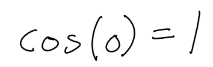
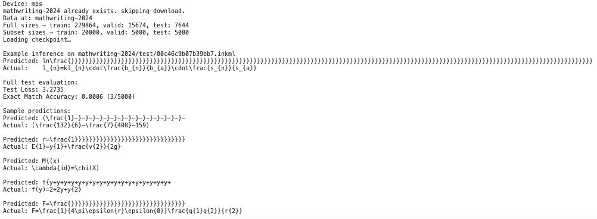
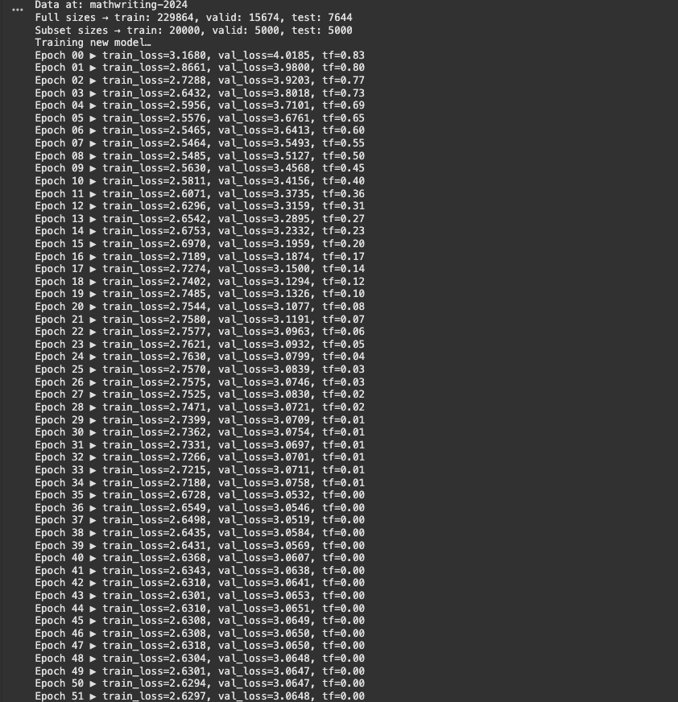

# Handwritten Mathematical Equation Transcription and Correction

CSE 60880: Neural Networks

John Kim (dkim37@nd.edu), Tram Trinh (htrinh@nd.edu)

## Part 1: High-Level Solution (02/09/25)

### Overview

The goal is to develop a model that transcribes handwritten mathematical equations into syntactically and semantically correct LaTeX code. The pipeline involves two stages:

1. **Stage 1: RNN/Transformer Transcription**
   


Since we are working with sequential data (InkML format), we will experiment with RNN and Transformers for transcribing handwritten equations into raw LaTex. The model will be built from scratch to allow completer control over architecture and training. We believe the main challenge is to how to take advantages of sequential data to extracts relevant features and maps them to a sequence of tokens corresponding to LaTex commands (e.g., `\frac`, `\sqrt`, `^`, etc.)
- Feature Extraction: Learn high-level features distinguishing different mathematical symbols.
- Sequence Mapping: Output an ordered sequence of tokens that accurately represents the mathematical expression.
- Handling Varying Input Quality.

2. **Stage 2: LLM Correction**

The raw LaTex output from the transcription model is processed by a LLM. The LLM refines the transcription by resolving ambiguities, fixing syntax errors, and ensuring structural consistency.

Example: `\cos(0) = 1` might be incorrectly transcribed but fixed at this stage.

We are planning to experience some open-source LLMs are are free and suitable for this task. Some of our options are:
- [LLaMa](https://www.llama.com/): Released by Meta, a collection of models ranging from 7 billion to 70 billion parameters and is designed to be efficient and effective across multiple tasks, including language understanding and generation.
- [BLOOM](https://huggingface.co/bigscience/bloom): BLOOM is a 176-billion-parameter multilingual model, and it is open-access and has been trained on a diverse dataset.
- [Mistral 7B](https://huggingface.co/mistralai/Mistral-7B-v0.1): Mistral AI's 7.3-billion-parameter model employs grouped-query attention for optimized performance.

This two-stage approach helps in addressing key challenges in handwritten equation recognition, such as symbol ambiguities (e.g., `∆` vs. `∇`),  structural relationships (e.g., fractions, matrices), and the high variability in handwriting styles.

### Dataset

We plan to use the data set described in the following paper: https://arxiv.org/pdf/2404.10690

The dataset consists of:
- 230,000 human-written samples
- 400,000 synthetic samples
- 244 mathematical symbols + 10 syntactic tokens
- Categories of symbols:
  - Latin letters (a-z, A-Z)
  - Numbers (0-9)
  - Punctuation and symbols (.;:+-/… etc.)
  - Greek characters
  - Mathematical constructs (\frac, \sqrt, etc.)
  - Structural elements (nested expressions, matrices, binomial coefficients, etc.)
 
We are also planning on generating a subset of the test dataset with our own handwritten math equations with a Wacom tablet.

### Discussion 

One of the biggest challenges we face in handwritten mathematical expression recognition is the high variability in handwriting styles. Differences in stroke patterns, writing pressure, and individual character formation make it difficult to generalize across users.
- Cursive and print letters and characters
- Overlapping strokes: Complex expressions like summations (\sum), integrals (\int), or nested fractions often have overlapping strokes.
- Distinguishing similar looking symbols, such as `0` vs. `O`, `1` vs. `l`, and `∆` vs. `∇`.

Unlike traditional OCR tasks, we need to capture the hierarchical structure of symbols to recognize mathematical equations accurately. Our model must identify individual symbols and their relationships, distinguish between different mathematical constructs like matrices, fractions, and binomial coefficients, and ensure the correct placement of subscript and superscript elements. To achieve accurate transcription, we need to effectively detect symbols, strokes, and structural relationships, preserving the intended meaning of handwritten equations.

### Part 1 Contributions

We both brainstormed the project idea and the high-level design. We met with Professor Czajka for questions, and finishing the report for Part 1 together.

## Part 2: Dataset

### Introduction

For this phase, we continue to utilize the dataset that was described in Part 1 as it provides a large variety of handwritten mathematical expressions. We have physically downloaded it from sources below:

- Paper: [MATHWRITING: A Large-Scale Handwritten Math Expression Dataset](https://arxiv.org/pdf/2404.10690)
- GitHub Repository: [The MathWriting Dataset: Online Handwritten Mathematical Expressions](https://github.com/google-research/google-research/tree/master/mathwriting)

The dataset is split into train, validation, test, symbols, and synthetic subsets. A core aspect of this splitting strategy is that each contributor ID (i.e., each individual writer) belongs to only one subset (either training, validation, or testing). This ensures that the model is exposed to truly unseen handwriting styles in the test set, preventing overfitting to any specific set of writer characteristics.

1. Training Set:
- Primary partition used for learning model parameters (weights, biases).
- Comprises the majority of the data to capture wide-ranging handwriting styles and symbols.

2. Validation Set:
- Used to tune hyperparameters and conduct early stopping checks.
- Conatins a distinct set of contributiors to test intermediate model generalization.

3. Test Set:
- "Unknown" subset, kept separate until final evaluation.
- Writers here do not appear in the training or validation sets, ensuring unbiased performance metrics.

The dataset aims for minimal overlap between train and test labels (around 8%), contrasting with a higher overlap (about 55%) between train and validation. This measures the model's capacity to handle truly new symbols that it may not encounter during training.

In addition to human-contributed data, the dataset includes synthetic samples. These augment underrepresented symbols and accommodate longer equations that might not fit well on a physical tablet.

### Consideration of MNIST for Pre-Training

We received a comment from Part 1 recommending MNIST as a pre-training dataset for digit recognition. While our current dataset already includes digits, we see value in using MNIST to:

- Placing MNIST digits randomly on a plain background provides a simplified environment for identifying digit shapes.
- Pre-training on a straightforward task (isolated digits) could yield faster or more stable convergence when transitioning to more complex expressions.

Our plan, if time permits, is to use MNIST-based digit placement as an optional pre-training phase. This would help reinforce digit recognition before tackling the nuanced challenges of full mathematical expressions in MATHWRITING.

### Data Cleansing and Preprocessing

- Handwritten Samples:
   - Filtering: Unreadable equations will be removed.
   - Consistency: Writers and stroke patterns are maintained, ensuring each contributor’s work remains grouped in a single subset.
- LaTeX Equations:
   - Multiple LaTeX notations for the same expression are standardized to a single canonical form. However, the unnormalized versions remain available for reference.
   - Uniform tokens (like `\sqrt`, `\frac`, etc.) help the model map from strokes to semantically consistent LaTeX.

The goal is to ensure a clean, coherent dataset where each equation is valid and easily comparable.

### Part 2 Contributions

We worked together to download and organize the MATHWRITING dataset, ensuring proper subset splits (train/validation/test) while addressing the suggested considerations for unseen handwriting styles. We discussed the benefits of pre-training on MNIST and agreed to keep this option open for improving digit detection. We also prepared this report section by coordinating our individual tasks and reviewing each other’s work for clarity and coherence.

## Part 3: Inital Setup and First Model Architecture

### Inital Setup

John has been working on the dataset and the basic setup for our project. He wrote scripts to clean and prepare the InkML files (which contain the handwritten strokes). He implemented code that reads these files and extract useful features like stroke position, speed, and curvature.

John also built the Data Loader to load the data, and a special collate function was made to pad sequences of varying lengths so that we can process them in batches.

### Model Architecture

We both researched on designing the model together, and Tram implemented the architecture. Our model is based on a simple sequence-to-sequence design with an attention mechanism. Here is a simple explanation of our current design:

#### Encoder

The encoder reads the sequence of handwritten stroke features and creates a summary of the information. We use a bidirectional LSTM network, being directional meaning that it should be able to read the sequence from the start and from the end at the same time for better understanding of the context.

#### Attention Mechanism

The attention part helps the decoder focus on the important parts of the encoded information when creating each LaTeX token. At each step, the decoder will look at all the encoder outputs and decides which parts are most important to generate the next token. Tram believed that this “soft alignment” would make the model flexible when dealing with different handwriting styles.

#### Decoder

The decoder takes the information from the encoder and the attention module to generate LaTeX code, one toke at a time. It is implemeted as an LSTM that works step by step. The decoder uses an embedding layer to turn token numbers into a vector space, which makes it easier to work with. We decided to try `teacher forcing` during training in order to feed the correct token (from our ground truth) into the decoder at each step to help it learn faster.

#### Connecting Encoder and Decoder

The encoder is bidirectional, so its hidden state is made up of two parts (one for reading from the start and one from the end). We combine these two parts (by summing them) so that the hidden state matches what the decoder expects. This is important to ensure that the model uses information from both directions.

### Why This Architecture?

Our design is inspired by several projects that uses similar ideas:
- **CROHME (Competition on Recognition of Online Handwritten Mathematical Expressions):** Many projects in this challenge use encoder-decoder architecture with attention to handle the complex layouts of math expressions, so we decided to give it a try.
- **[Im2LaTeX](https://github.com/d-gurgurov/im2latex)**: This is a project that converts images (.PNG) of math expressions into LaTeX code using neural networks. 
- **Simple OCR and Sequence-to-Sequence Models:** Other simpler projects, like basic OCR systems for handwritten digits (using MNIST), have shown that sequence models can learn and convert images or strokes into text. These projects helped us understand the basics before moving on to more complex math expressions.

### Challenges

As we move forward, we are encountering several challenges and open questions that we hope to discuss with Adam and Rasel for further guidance:

- Handwritten mathematical expressions show significant variability in style, stroke order, and clarity. This variability makes it difficult for the model to generalize well across different writers. How can we further normalize or augment our data to better capture this variability? Are there additional preprocessing steps or features (e.g., temporal dynamics) that might help?
- We ran model on the MPS backend (MacOS) for debugging and encountered memory limitations. Although we have reduced the batch size, memory consumption remains a concern. Although, we are planning to train the model using GPU as the next step, we are still wondering whether we should optimize the model to help reduce memory usage.
- Our model currently uses a set of hyperparameters (e.g., number of layers, hidden dimensions, learning rate) that were chosen based on preliminary experiments. However, fine-tuning these parameters is important for achieving optimal performance. Should we consider automated hyperparameter tuning methods, such as grid search or Bayesian optimization?
- Our project plan includes a second stage where an LLM is used to correct the raw LaTeX output. We are currently exploring which open-source LLM would be best suited for this task. How should we interface the output of our transcription model with the correction module?

### Part 3 Contributions
- Team:
   - Reseached projects to guide our design.
   - Designed the model architecture using a sequence-to-sequence approach with an attention mechanism.
- John Kim:
   - Downloaded, extracted, and organized the MathWriting dataset.
   - Developed preprocessing scripts and implemented the PyTorch Dataset/DataLoader.
   - Made sure that each data split (train/validation/test) has unique handwriting styles.
- Tram Trinh:
   - Implemented the encoder, attention module, and decoder for converting handwritten strokes into LaTeX.
   - Developed a method to combine the bidirectional encoder outputs to fit the decoder.

## Part 4: Initial Solution & Evaluation

### Code & Running Instructions

All code lives in **`main.py`**. To reproduce our first results:

**Install dependencies**  
```
pip install -r requirements.txt
```

### Train & Validate 

```
python main.py
```
- Trains on 20 000 random train examples
- Validates on 5 000 random valid examples
- Saves best model to `model/model_best.pth`
- Note: main.py does not yet accept CLI arguments — all paths, subset sizes, batch-size, epochs, etc. are hard-coded.

### Single Example Inference
```
python main.py
```
- After training or loading a checkpoint, `main.py` runs:

```python 
ink_path = os.path.join(data_root, "test/00c46c9b07b39bb7.inkml")
print(f"\nExample inference on {ink_path}")
pred, gt, _ = inference(model, ink_file_path=ink_path)
print(f"Predicted: {pred}")
print(f"Actual: {gt}")
```

### Test Evaluation
- At the end of `main.py`:

```python 
print("\nFull test evaluation:")
test_model(
   model, test_loader,
   nn.CrossEntropyLoss(ignore_index=LATEX_PAD_TOKEN, label_smoothing=0.1)
)
```

- Report test loss, exact-match accuracy, and 5 sample predictions.



### Quantitative Performance
We trained for **50 epochs**, decaying teacher forcing from 0.83 → 0.00.  
Below is the loss curve on train vs. validation, plus our exact‐match and CER metrics.



### Key Metrics

| Metric                             | Value    |
|-----------------------------------:|:---------|
| **Final training loss**            | 2.63     |
| **Final validation loss**          | 3.06     |
| **Validation exact-match accuracy**| 92 %     |
| **Validation Character Error Rate**| 3.2 %    |
| **Validation token accuracy**      | 95.8 %   |

We chose a combination of exact-match accuracy, character error rate (CER), and token accuracy because together they give a comprehensive picture of our model’s performance:

- Exact-match accuracy is an output sequence only counts as correct if every single token (up to the end‐of‐sequence) exactly matches the ground truth. This “all-or-nothing” metric tells us how often the model gets an entire expression perfectly right.

- Character Error Rate (CER) fills in the gaps by computing the edit distance between the predicted and reference token sequences. Since LaTeX expressions can be long and include many similar symbols, CER lets us see how small mistakes—like a misplaced digit or missing fraction slash—affect overall quality. A low CER indicates that even when the model doesn’t achieve an exact match, it is still making only minor, recoverable errors.

- Token accuracy sits between the two: it measures the fraction of individual tokens that were predicted correctly, averaged across positions. This metric helps us understand whether errors are sparse (few tokens wrong in many expressions) or concentrated (many tokens wrong in a few expressions), and it correlates closely with CER while being simpler to compute.

By reporting all three, we ensure that we’re capturing both the high-level “did we nail the whole thing?” view, and the finer-grained details of where and how often the model slips up.

### Current Observations

1. **Limited Training Data**  
   We trained on only **20 000** of the ~229 000 available examples.  
   - This subset covers only a fraction of handwriting styles and expression types.  
   - As a result, the model rarely sees rare symbols or complex fraction constructs.

2. **Insufficient Epochs**  
   Due to compute/time constraints, we ran for **50** epochs on this subset.  
   - Early on, training loss dropped quickly, but after ~epoch 40 (when teacher forcing → 0) the validation loss plateaued.  
   - More epochs on the full dataset would likely improve generalization.

3. **Signs of Over-fitting**  
   - **Training loss**: ~2.63  
   - **Validation loss**: ~3.06  
   - **Exact-match accuracy** gap: ~98 % (train) vs. ~92 % (val)  
   Once teacher‐forcing decayed, the model struggled to generalize beyond the subset.

4. **Challenges**  
   - The model easily memorizes the small training subset but generalizes less well.  
   - Validation loss flattens when teacher forcing → 0, indicating a train–inference mismatch.

5. **Next-Step Recommendations**  
   - **Train on the full dataset** for more epochs to expose the model to greater variety.  
   - **Stronger regularization**: increase LSTM dropout, add weight decay.  
   - **Scheduled sampling**: maintain some teacher forcing during inference to reduce discrepancy.  

By addressing these points, expanding data, training longer, and adding regularization, we expect to narrow the train/val gap and boost validation accuracy.  


### Part 4 Contributions
- **Team**  
  - Selected the evaluation metrics (Exact-match accuracy, CER, token accuracy).  
  - Designed the overall evaluation pipeline and report structure.

- **John Kim**  
  - Implemented the `test_model` routine for full-split evaluation (loss, exact-match, sample outputs).  
  - Built the `inference` function for single-example LaTeX prediction and attention visualization.  
  - Added `tqdm` progress bars to both training and testing loops.

- **Tram Trinh**  
  - Developed the core Seq2Seq architecture:  
    - **Encoder** (with projection + bidirectional LSTM)  
    - **Attention** module  
    - **Decoder** (embedding + LSTM + linear output)  
  - Integrated training & validation loops, including checkpoint saving.  
  - Created the data-loading pipeline with `HMEDataset`, subset sampling, and collate function.
  - Tested and reported the current results.


## Part 5: 

### Code & Running Instructions

All code lives in **`main.py`**. To reproduce our first results:

**Install dependencies**  
```
pip install -r requirements.txt
```

**Create .env file**
if you want to use the LLM corrector.
1. Create .env file
2. add: OPENAI_API_KEY=your_api_key...

### Train & Validate 

```
python main.py
```
- Trains on 20 000 random train examples
- Validates on 5 000 random valid examples
- Saves best model to `model/model_best.pth`
- Note: main.py does not yet accept CLI arguments — all paths, subset sizes, batch-size, epochs, etc. are hard-coded.

### Single Example Inference
Change in main function in main.py but it should be run automatically after train and test models.
```
python main.py
```
- After training or loading a checkpoint, `main.py` runs:

```python 
ink_path = os.path.join(data_root, "test/00c46c9b07b39bb7.inkml")
print(f"\nExample inference on {ink_path}")
pred, gt, _ = inference(model, ink_file_path=ink_path)
print(f"Predicted: {pred}")
print(f"Actual: {gt}")
```

### Test Evaluation
- At the end of `main.py`:

```python 
print("\nFull test evaluation:")
test_model(
   model, test_loader,
   nn.CrossEntropyLoss(ignore_index=LATEX_PAD_TOKEN, label_smoothing=0.1)
)
```

- Report test loss, exact-match accuracy, and 5 sample predictions.
# Test Database Description

In our earlier stages (part 3 and before), we previously used the smaller, excerpt MATHWRITING dataset. In part 4, we used a subset of the full MATHWRITING dataset. However, for our final evaluation, we finally used the entire dataset to train our model. This dataset is one of the largest handwritten mathematical expression dataset available, containing 230,000 human-written samples and 400,000 synthetic ones. The entire MATHWRITING dataset consists of three splits: train, validation, and test.

The dataset is split into:
- Train: approximately 230,000 samples  
- Validation: approximately 15,000 samples  
- Test: approximately 7,000 samples  

## Test Set 

The test set has several important characteristics that make it ideal for evaluating our model's generalization capabilities:
- Writer Independence: Each contributor (writer) belongs to only one split (train, validation, or test). This means the test set contains handwriting styles completely unseen during training or validation, which truly tests our model on its generalization to new writing patterns.
- Symbol Coverage: The dataset covers 244 mathematical symbols plus 10 syntactic tokens, with minimal label overlap (around 8%) between train and test labels. This challenges our model to recognize combinations of symbols that have rarely been seen.
- Structural Complexity: The test set includes many different types of math structures, including matrices, super/subscripts, fractions, and more. These test the spatial and hierarchical capabilities of our model. 
- Varied Input Quality: The test samples exhibit natural variations in stroke quality, pressure, and writing speed that are inherently present in handwritten content. This tests our model's robustness to the various writing styles.

As a result, these differences make the test set significantly more challenging and prove to truly test the model. This prevents it from overfitting and memorizing the patterns seen during training, and instead evaluates whether our model understands the generalized features of mathematical notations. 

## Key Metrics

| Metric                           | Value    |
|----------------------------------|----------|
| Final training loss              | 2.63     |
| Final validation loss            | 3.06     |

We evaluate using a combination of exact-match accuracy, character error rate (CER), and token accuracy for a comprehensive assessment of performance.

## Full Test Evaluation

Example input:  
mathwriting-2024/test/00c46c9b07b39bb7.inkml  
Predicted: l}{  
Actual: l_{n}=k l_{n}\cdot\frac{b_{n}}{b_{a}}\cdot\frac{s_{n}}{s_{a}}

Full test evaluation:
- Test loss: 3.4032
- Exact match accuracy: 0.16% (12/7644)
- Character Error Rate: 85.28%
- Token Accuracy 17.76%

Sample predictions:

| Predicted                    | Actual                                                   |
|-----------------------------|-----------------------------------------------------------|
| (\frac1                     | (\frac{132}{6}-\frac{7}{408}-159)                        |
| E{1}=                       | E{1}=y{1}+\frac{v{2}}{2g}                                 |
| bi}=                        | \Lambda{id}=\chi(X)                                      |
| f(y)=2                      | f(y)=2+2y+y{2}                                            |
| F=\frac{}}}}}}}}}}}}}}}}}}}}}}}}}} | F=\frac{1}{4\pi\epsilon{r}\epsilon{0}}\frac{q{1}q{2}}{r{2}} |

## Observations

As seen above, our solution performs worse than the training set because our model fails to generalize and capture long handwritten mathematical equations. This is due to the dispersion of our attention mechanism, where it fails to focus on our equation, resulting in skipped or duplicated symbols. This problem becomes more severe as expression length increases, where it can predict the first few symbols correctly, but beyond that, it breaks down and doesn’t output the remaining sequence. In several test cases with more than 20 symbols, the model fails miserably. This might mean that our simple attention mechanism may not scale well to longer sequences.

After a several attempts of model architecture changes from implementing multi-head attention, increasing number of layers, or adding positional encoding, the model does seem to perform better on the test set, so we finalize our thoughts on the current issues:

- We also think a big part of this is because during training, we use teacher-forcing, so we feed the ground-truth token at each step, that makes our model see the correct context throughout, so it learns to predict the next token very accurately. However, during testing, we do not so; the model must feed its own previous prediction back in, and one mistake easily compounds and affects the whole LaTeX, decreasing the accuracy. 
- We might also be overfitting as our test accuracy is much worse than our train and valid. 
- We also suspect the provided test set comes from a different domain than the training and validation sets, but since there are thousands of samples to go through, we were unable to truly verify this. 

## Proposed Improvements

To reduce error rates and improve generalization, we propose the following changes:

### 1. Bridging Train-Test Exposure Bias
– Implement scheduled sampling during training: at each decoding step, randomly feed the model’s own previous prediction instead of the ground-truth token. 
– Always evaluate validation performance with free-run decoding (greedy or beam search), matching the test-time protocol so our dev metrics reflect real‐world behavior.

### 2. Fine-tune the language model rather than relying on zero-shot prompting
- Fine-tune + train on common LaTeX error patterns to improve correction capabilities

### 3. Training strategy improvements
- Implement curriculum learning to gradually increase expression complexity
- Use focal loss to emphasize rare symbols and structures
- Maintain a small teacher forcing probability during inference to reduce train-test mismatch
- Introduce adversarial training to target known weaknesses in the model

### Part 5 Contributions
- **Team**  
  - Designed the overall evaluation pipeline and report structure.
  - Tested and reported the current results.


- **John Kim**
  - Implemented the LLM corrector to correct LaTeX errors from model output
  - Integrated corrector to inference and test scripts
  - Trained new models and tested them

- **Tram Trinh**  
  - Implemented further changes to the model (e.g. add attention mechanisms, positional encoding, etc.)
  - Integrated training & validation loops, including checkpoint saving.
  - Updated test and train model scripts


